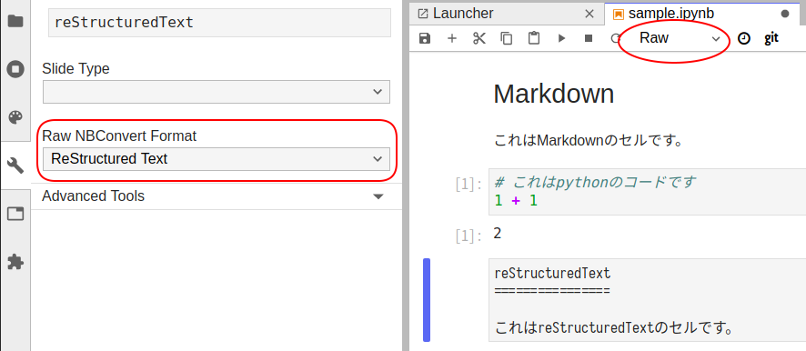

# SphinxConJP2019

SphinxCon JP 2019

nbsphinxクイックスタート

## インストール

```bash
pip install jupyter nbsphinx
```

## プロジェクトを作成

```bash
sphinx-quickstart -q -p nbsample -a nbauther --sep
```

`source/conf.py`

下記を追記

```python
extensions = [
    'nbsphinx',
    'sphinx.ext.mathjax',
]
exclude_patterns = ['_build', '**.ipynb_checkpoints']
```

## Jupyter原稿を書く

`source/sample.ipynb`


### Jupyter NotebookでreSTセルにする方法


### JupyterLabでreSTセルにする方法



### toctreeにNotebookを追加

拡張子は含めない

`source/index.rst`

```rest
.. toctree::
   :maxdepth: 2
   :caption: Contents:

   sample
```

## ビルド

```bash
make html
```


